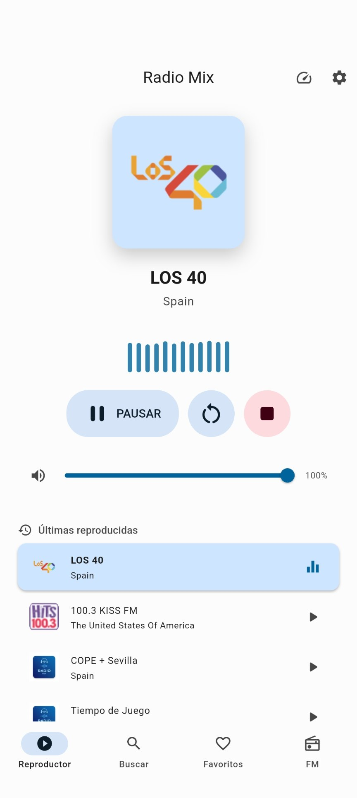

# RadioMix

Aplicacion Flutter para radio online y podcasts con reproduccion en segundo plano, favoritos, suscripciones, descargas offline y backup local.

## Captura de pantalla

<p align="center">
  
</p>

## Estado actual

- Proyecto Flutter multiplataforma con foco practico en Android
- Reproduccion en segundo plano con `just_audio` + `audio_service`
- Persistencia local con `SharedPreferences`
- Descarga de episodios a almacenamiento interno
- Backup y restauracion en XML

Version de la app: `1.6.5+5`

Fecha de esta documentacion: 2026-08-11

## Funcionalidades

- Buscar emisoras online
- Reproducir radios en streaming
- Guardar radios favoritas
- Anadir emisoras personalizadas manualmente
- Buscar podcasts
- Suscribirse a podcasts
- Cargar episodios desde RSS
- Continuar reproduccion desde el ultimo progreso guardado
- Descargar episodios para reproduccion offline
- Gestionar volumen y buffer de audio
- Exportar e importar backup local
- Controles multimedia del sistema en Android

## Limitaciones conocidas

- La pantalla FM es experimental y actualmente no usa hardware FM real
- El backup no incluye los archivos descargados de podcasts
- `README.md` describe el estado actual observado en codigo, no un roadmap cerrado de producto

## Stack

- Flutter `3.44.9`
- Dart `3.12.2`
- Material 3
- Riverpod
- just_audio
- audio_service
- audio_session
- http
- xml
- shared_preferences
- path_provider
- file_picker
- share_plus

## Estructura del proyecto

```text
lib/
  main.dart
  models/
  screens/
  services/
  widgets/
assets/
  icon/
  logo_options/
  store/
docs/
scripts/
android/
ios/
macos/
linux/
windows/
web/
test/
```

Archivos clave:

- `lib/main.dart`: arranque de app, tema y bootstrap de audio
- `lib/screens/home_screen.dart`: shell principal con navegacion
- `lib/screens/player_screen.dart`: reproductor central
- `lib/screens/search_screen.dart`: busqueda de radios y podcasts
- `lib/screens/favorites_screen.dart`: favoritos y suscripciones
- `lib/screens/podcast_detail_screen.dart`: detalle y episodios de podcast
- `lib/screens/settings_screen.dart`: ajustes, backup y limpieza de descargas
- `lib/services/audio_player_service.dart`: servicio central de audio
- `lib/services/app_audio_handler.dart`: integracion con controles del sistema

## Arquitectura resumida

La app sigue una arquitectura ligera por capas:

- UI: pantallas y widgets Flutter
- Estado: Riverpod + estado local con `setState`
- Servicios: audio, radio, podcasts, progreso, descargas y backup
- Datos locales: `SharedPreferences` + filesystem
- Integraciones externas: Radio Browser, iTunes Search, RSS y streams de audio

Documentación pública:

- [Política de privacidad](./docs/privacy_policy.html)

## Requisitos de desarrollo

- Flutter SDK compatible con la version actual del proyecto
- Android SDK y JDK 17 o 21 para compilar Android
- macOS, Xcode y CocoaPods para compilar iOS
- Cuenta de Apple Developer para ejecutar en un dispositivo físico o distribuir
  una versión firmada de iOS
- Entorno con acceso a internet para buscar radios, podcasts y reproducir streams remotos

## Preparación común

```bash
flutter doctor -v
flutter pub get
flutter analyze
flutter test
```

## Compilar para Android

La compilación Android puede realizarse en Linux, macOS o Windows. Los scripts
del repositorio seleccionan automáticamente una instalación compatible de JDK
17 o 21.

Para listar dispositivos y ejecutar la aplicación:

```bash
flutter devices
./scripts/android_run.sh
```

Para generar artefactos release:

```bash
# APK universal
./scripts/android_build_apk.sh

# Android App Bundle para Google Play
./scripts/android_build_appbundle.sh

# APK independiente para cada ABI
./scripts/android_build_apk_split.sh
```

Cada comando muestra al finalizar la ubicación de los artefactos generados.
Antes de distribuir una release, configura una firma de publicación y evita
incorporar credenciales o claves al repositorio. Para más detalle, consulta la
[guía oficial de compilación Android](https://docs.flutter.dev/deployment/android).

## Compilar para iOS

Flutter solo permite compilar iOS desde macOS con Xcode. Este proyecto tiene
como mínimo iOS 13.0.

Prepara Xcode y abre el simulador:

```bash
sudo xcodebuild -license
xcodebuild -downloadPlatform iOS
open -a Simulator
flutter devices
```

Para ejecutar la aplicación, sustituye `<device-id>` por el identificador que
muestre `flutter devices`:

```bash
flutter run -d <device-id>
```

Para compilar para el simulador o validar una release sin firma:

```bash
flutter build ios --simulator
flutter build ios --release --no-codesign
```

Antes de ejecutar en un dispositivo físico o crear una IPA firmada, abre el
workspace de Xcode:

```bash
open ios/Runner.xcworkspace
```

En el target `Runner`, revisa `Signing & Capabilities`, selecciona el equipo de
Apple Developer y sustituye el identificador provisional
`com.example.radioMix` por un Bundle Identifier propio y único.

Para generar el archivo de distribución:

```bash
flutter build ipa --release
```

El comando muestra al finalizar la ubicación del archivo Xcode y de la IPA. La
versión puede sobrescribirse en una compilación concreta:

```bash
flutter build ipa --release --build-name 1.6.5 --build-number 5
```

Consulta la [configuración oficial de iOS](https://docs.flutter.dev/platform-integration/ios/setup)
y la [guía oficial de distribución iOS](https://docs.flutter.dev/deployment/ios)
para configurar certificados, perfiles y App Store Connect.

## Verificaciones basicas

```bash
flutter analyze
flutter test
./scripts/android_with_jdk.sh ./gradlew :app:processDebugMainManifest
```

Última validación local (2026-08-11): análisis sin incidencias, `52` pruebas
correctas y procesamiento del manifest Android completado.

## Persistencia local

Claves observadas en `SharedPreferences`:

- `theme_mode`
- `favorite_stations`
- `podcast_subscriptions`
- `podcast_downloads`
- `audio_buffer_seconds`
- `recent_stations`
- `playback_progress_<stationId>`

Archivos locales:

- episodios descargados: `Documents/podcasts`
- backup exportado: XML temporal compartido desde la app

## APIs y fuentes externas

Radio:

- `https://de1.api.radio-browser.info/json/stations/search`
- `https://de1.api.radio-browser.info/json/stations/topvote/10`

Podcasts:

- `https://itunes.apple.com/search`
- RSS del feed de cada podcast

## Audio y reproduccion

El pipeline de audio reutiliza el mismo servicio para radios y podcasts.

Puntos clave:

- `AudioPlayerService` posee el `AudioPlayer`
- `AppAudioHandler` publica metadata y controles del sistema
- Los podcasts habilitan seek, progreso y reanudacion
- Las radios usan play/pause/stop sin barra de progreso

## Backup y restauracion

El backup exporta:

- radios favoritas
- podcasts suscritos
- progreso de reproduccion
- preferencias de usuario y proveedores configurados
- metadata de descargas, sin rutas ni archivos de audio

Los backups pueden contener credenciales de proveedores introducidas por el
usuario y deben tratarse como archivos sensibles.

## Testing actual

La suite incluye pruebas de modelos, servicios, persistencia, backup, audio,
búsqueda, coordinación de reproducción y widgets principales. La referencia
válida es siempre el resultado de `flutter test` en el commit que se publique.
